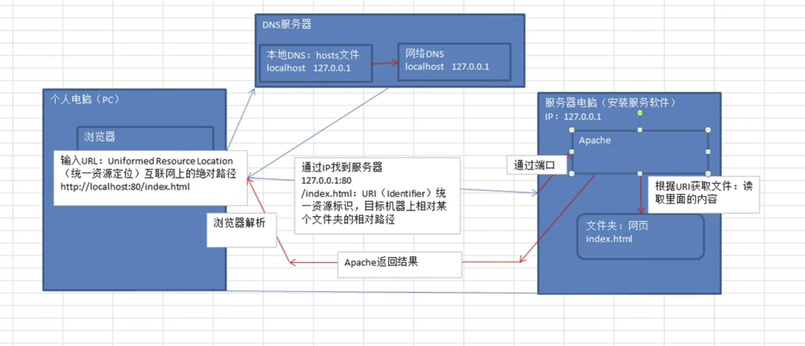
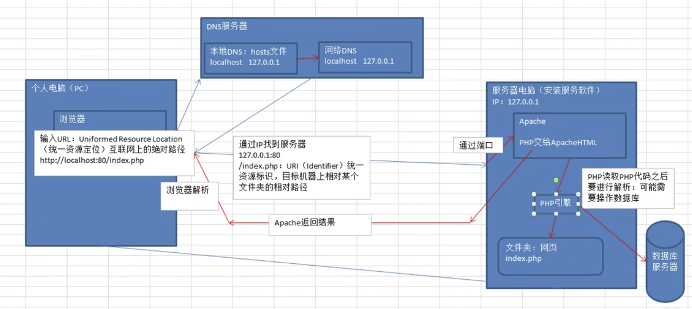

# PHP
## What is PHP?
PHP is a HTML script, running on the service side, and it's used to write dynamic web page.
1. 什么是静态网站（static website）?
每一个页面都是一个文件，保存在服务器上。没有数据库的支持，交互性差。稳定，易于被搜索引擎检索。

> 后缀：htm, html, shtml, xml

2. 什么是动态网站？（dynamic website）
网页会根据用户的要求和选择动态的改变和响应，交互性强，自动更新。动态网页网址中有--“？”

> 后缀：asp, jsp, php, perl, cgi

3. DNS：域名解析
浏览器发起访问(用户输入域名 localhost) -> DNS解析域名(127.0.0.1) -> 服务器电脑 -> 对应端口 -> 找到相应程序

## 静态网站和动态网站访问流程
### 静态页面访问

### 动态页面访问
